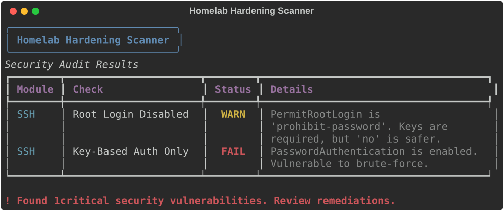

# 🛡️ Homelab Hardening Scanner

*An automated SecOps auditing tool to verify the security posture of Linux servers.*

## 📌 Overview

**Homelab Hardening Scanner** is a read-only configuration auditor for Linux machines (like a Raspberry Pi home server, VPS, or bare-metal setup). I built this tool to put my cybersecurity certification into practice through automation. 

Instead of checking server configurations by hand, this script inspects critical files and tells you exactly what passes, what fails, and what needs a warning based on standard security baselines.

## 🚀 Core Features

- **🔒 SSH Posture Audit:** Checks `/etc/ssh/sshd_config` to ensure strict access rules are in place (like `PermitRootLogin no` and `PasswordAuthentication no`).
- **🧱 Firewall Validation:** Verifies if a firewall (`ufw` or `iptables`) is actually running and dropping inbound traffic by default.
- **👥 User & Privilege Audit:** Safely parses `/etc/shadow` to find active accounts missing passwords, and lists users with `sudo` or `wheel` access.
- **📊 Multi-format Reporting:** Prints a clean terminal UI using `rich`. Future updates will include JSON and Markdown exports for CI/CD pipelines.

## 🛠️ Tech Stack

- **Python 3.11+**
- **[Pydantic](https://docs.pydantic.dev/):** For strict data models.
- **[Rich](https://rich.readthedocs.io/):** For the terminal interface and color-coded tables.
- **[uv](https://github.com/astral-sh/uv):** For fast dependency management.

## 🚧 Status

This project is currently in active development. The base architecture, dependency management, and the SSH auditing module are done. Parsing logic for the firewall and user permissions is coming next.
